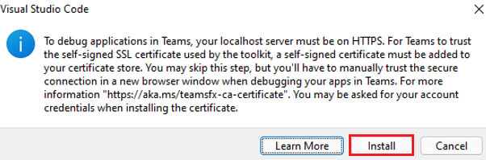

# Configuración del laboratorio

Complete las tareas siguientes para preparar el entorno de desarrollo antes de completar los laboratorios:

## Requisitos previos del laboratorio

Necesita las siguientes herramientas para completar los laboratorios de este curso:

- Acceso de administrador a un inquilino de Microsoft 365.
- Suscripción a Azure.
- Visual Studio Code.
- Extensión de Visual Studio Code del kit de herramientas de Teams:  versión 5.0.0 o posteriores. (Lo instalará durante el laboratorio)
- Cliente de Microsoft Teams (para trabajo o escuela) o acceso a Microsoft Teams a través de un explorador web.
- Node.js versión 16.14.2.

## Instalación de nvm-windows

Usará esta herramienta para instalar Node.js y, opcionalmente, cambiar las versiones de Node según sea necesario para los proyectos.

1. En un explorador web, vaya a [https://github.com/coreybutler/nvm-windows/releases](https://github.com/coreybutler/nvm-windows/releases).
2. Busque la versión más reciente y seleccione el archivo **nvm-setup.zip** que se va a descargar.  El archivo se descargará en el equipo.
3. Abra la carpeta de archivos y **extraiga** el contenido de la carpeta ZIP en una carpeta del equipo.
4. En la nueva carpeta, seleccione **nvm-setup.exe** para abrir el archivo de instalación.
5. Siga las indicaciones del instalador para instalar la herramienta mediante las opciones predeterminadas.
6. Nvm para Windows se instalará en el equipo.

## Instalación de Node.js

Instale Node.js versión 16.14.2, que es compatible con todas las soluciones de este curso.

1. Abra la aplicación del **símbolo del sistema**.
2. Escriba el comando `nvm install 16.14.2` para instalar Node.js.
3. La salida nvm debe confirmar que la instalación se ha completado.
4. Ejecute el comando `nvs use 16.14.2` para usar esta versión de Node.js.
5. Ejecute el comando `node -v` para confirmar que tiene instalada la versión 16.14.2.

Ya ha instalado y configurado Node.js versión 16.14.2

## Suscripción de Azure

Tenga en cuenta que si se le ha proporcionado información de inicio de sesión de Azure, ya se ha creado un grupo de recursos para su uso.  En Tareas de aprovisionamiento en todos los laboratorios, cuando se le pida que "seleccione un grupo de recursos o cree un nuevo grupo de recursos", **seleccione el grupo de recursos proporcionado**.

## Depuración de aplicaciones de Teams

Al depurar la aplicación de Teams localmente, es posible que se le pida que instale un certificado de desarrollo para localhost.  Tendrá que hacerlo para depurar localmente.

Cuando se le solicite, seleccione **Instalar**.

A continuación, seleccione **Sí** en el cuadro de diálogo Advertencia de seguridad.

Visite la documentación de Teams para obtener más información: [Depurar la aplicación de Teams localmente](https://learn.microsoft.com/microsoftteams/platform/toolkit/debug-local?tabs=Windows&pivots=visual-studio-code-v5)
