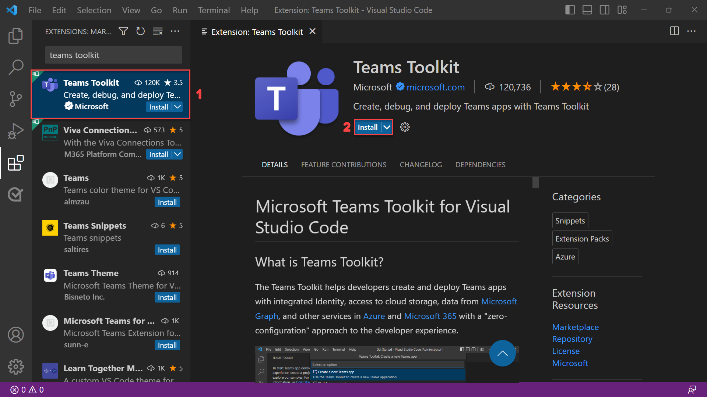

# Ejercicio 1: Instalación y configuración del Kit de herramientas de Teams para Visual Studio Code

En este ejercicio, instalará el Kit de herramientas de Teams para Visual Studio Code y configurará el entorno.

## Tarea 1: Instalar el Kit de herramientas de Teams para Visual Studio Code

1. Abra **Visual Studio Code**.
2. Seleccione el icono **Extensiones** situado en la barra lateral.
3. Busque "Kit de herramientas de Teams" en la sección **Extensiones** mediante la barra de búsqueda. A continuación, seleccione **Instalar**.

**Nota**:  Los ejercicios de este módulo usan el Kit de herramientas de Teams v5.6.0. Tenga en cuenta que las versiones secundarias pueden variar.

También puede instalar el Kit de herramientas de Teams desde [Visual Studio Marketplace](https://marketplace.visualstudio.com/items?itemName=TeamsDevApp.ms-teams-vscode-extension).

## Tarea 2: Preparación de la cuenta profesional o educativa de Microsoft 365

Si ya tiene acceso de administrador a una cuenta profesional o educativa de Microsoft 365 adecuada para desarrollo y pruebas, puede usarla para ejecutar y depurar la aplicación. Asegúrese de utilizar un inquilino en el que sea seguro realizar operaciones sin afectar a los usuarios reales.

De lo contrario, puede crear una cuenta de prueba gratuita mediante el [Programa para desarrolladores de Microsoft 365](https://aka.ms/m365developers).  Una vez completada la instalación, el Programa para desarrolladores de Microsoft 365 le proporcionará acceso de administrador a un inquilino que puede usar para compilar aplicaciones de Teams.

## Tarea 3: Configuración de un inquilino de Microsoft 365 para cargar aplicaciones para Teams

Para activar la carga de aplicaciones personalizadas para el inquilino, siga estos pasos:

1. Inicie sesión en el [Centro de administración de Microsoft Teams](https://admin.teams.microsoft.com) con sus **credenciales de administrador de Microsoft 365**.

2. En la barra lateral, seleccione **Aplicaciones de Teams** y, a continuación, seleccione **Directivas de instalación**.

3. Seleccione la **directiva global (valor predeterminado para toda la organización)** y, a continuación, active el botón de alternancia **Cargar aplicaciones personalizadas**.

   

4. Seleccione el botón **Guardar** para guardar los cambios. El inquilino ahora está configurado para permitir la instalación de prueba de aplicaciones personalizadas.

En la unidad siguiente, aprenderá a crear una aplicación de Teams y a ejecutarla localmente en Teams.
