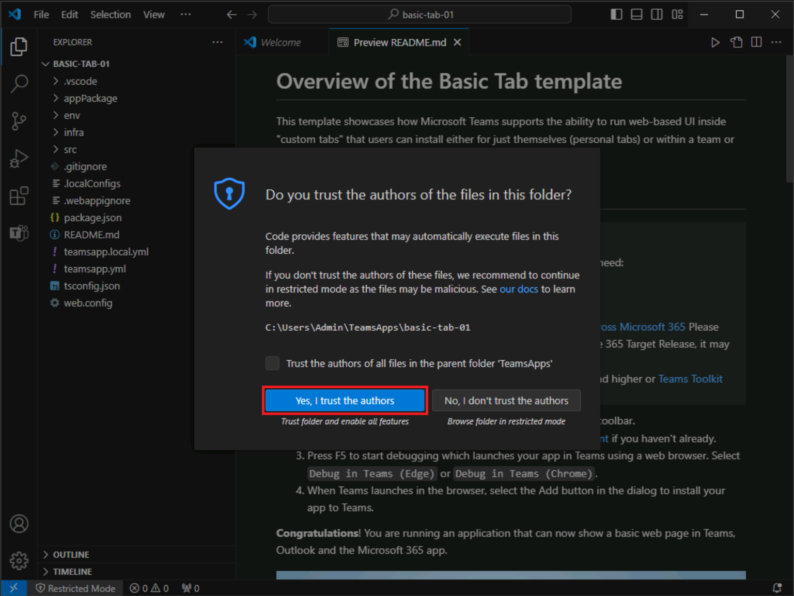

# Ejercicio 2: Crear una aplicación de Teams a partir de un ejemplo en la galería

El Kit de herramientas de Teams para Visual Studio Code proporciona una colección de ejemplos listos para explorar y crear la aplicación base a partir de ellos. En este ejercicio, creará su primera aplicación de Microsoft Teams desde la galería de ejemplos.

Siga una de las tareas siguientes para crear una aplicación de Teams a partir de un ejemplo o para crear una nueva aplicación de Teams con el Kit de herramientas de Teams.

## Tarea 1: Crear una aplicación a partir de una plantilla

1. En la barra lateral de Visual Studio Code, seleccione el botón **Kit de herramientas de Teams** para abrir el Kit de herramientas de Teams.

2. En el Kit de herramientas de Teams para Visual Studio Code, seleccione **Ver ejemplos** para ver un catálogo de aplicaciones de ejemplo.

   

3. Busque un ejemplo que le interese y seleccione la captura de pantalla para abrir la página de ese ejemplo.  Para ponerse en marcha rápidamente, seleccione un ejemplo que muestre "Listo para depurar" en el título de ejemplo de la página de detalles del ejemplo.  (Otros ejemplos mostrarán "Configuraciones manuales necesarias").

4. En la página de ejemplo, seleccione **Crear** y elija una carpeta para guardar el proyecto. Se aplicará scaffolding al proyecto en esta carpeta local.

    

5. Cuando haya terminado el scaffolding, verá una nueva ventana de Visual Studio Code con el proyecto del Bot de Hola mundo cargado.  Después de aplicar scaffolding al proyecto, es posible que reciba un mensaje de Visual Studio Code preguntándole si confía en los autores de los archivos de esta carpeta. Seleccione el botón **Sí, confío en los autores** para continuar.

    

6. Ahora puede ver el código del proyecto, que incluye:

- El código de la aplicación de Teams.
- Archivos de implementación y manifiesto dentro de la carpeta appPackage.
- Variables de entorno dentro de la carpeta env.
- Un archivo LÉAME que proporciona los pasos necesarios para ejecutar, depurar e implementar la aplicación.

    

## Tarea 2: Creación de una aplicación de Teams

También puede crear una nueva aplicación de Teams con el Kit de herramientas de Teams.

1. En el Kit de herramientas de Teams, seleccione **Crear una nueva aplicación**.
2. En el menú Nuevo proyecto, seleccione** **Extensión de mensaje**.
3. Cuando se le pida que seleccione una funcionalidad, seleccione **Resultados de búsqueda personalizados**.
4. Cuando se le pida que seleccione una opción, seleccione **Iniciar con un bot**.
5. Cuando se le pida que seleccione un lenguaje de programación, seleccione **TypeScript**.
6. Cuando se le pida que seleccione una carpeta, seleccione **Carpeta predeterminada** o elija otra ubicación de archivo.
7. **Escriba un nombre de aplicación** de su elección para la aplicación de extensión de mensaje y seleccione **Entrar**.
8. El Kit de herramientas de Teams aplicará scaffolding a una nueva aplicación y abrirá la carpeta del proyecto en Visual Studio Code.
9. Puede recibir un mensaje de Visual Studio Code que le pregunte si confía en los autores de los archivos de esta carpeta. Seleccione el botón **Sí, confío en los autores** para continuar.
10. Ahora puede ver el código del proyecto, que incluye:

- El código de la aplicación de Teams.
- Archivos de implementación y manifiesto dentro de la carpeta appPackage.
- Variables de entorno dentro de la carpeta env.
- Un archivo LÉAME que proporciona los pasos necesarios para ejecutar, depurar e implementar la aplicación.
