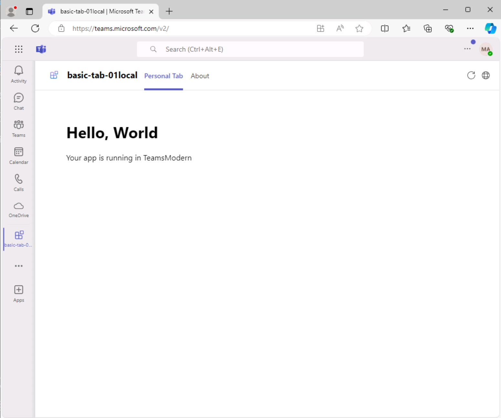

# Ejercicio 3: Ejecución de la aplicación de Teams

En este ejercicio, ejecutará la aplicación Teams localmente.

## Tarea 1: Inicie sesión en Microsoft 365

1. En Visual Studio Code, abra el **Kit de herramientas de Teams** y seleccione **Iniciar sesión en Microsoft 365**.

    

2. En el cuadro de diálogo emergente, seleccione **Iniciar sesión**. Se le lleva a un explorador para iniciar sesión con las **credenciales de la cuenta de Microsoft 365**.  Escriba las credenciales de administrador.

3. Cuando haya iniciado sesión correctamente, cierre el explorador y vuelva a Visual Studio Code. Aparece un mensaje **Carga de aplicación personalizada habilitada** en su cuenta en el Kit de herramientas de Teams para indicar que el inquilino está configurado correctamente.

    

## Tarea 2: Ejecución de la aplicación de forma local

Vamos a ejecutar el proyecto y comprobar cómo se verá en Microsoft Teams.

1. En la barra lateral, seleccione el icono **Depurar** para abrir el panel **EJECUTAR Y DEPURAR**.
2. En el panel **EJECUTAR Y DEPURAR**, seleccione **Chrome** o **Edge** en el cuadro de lista desplegable como explorador que desea usar para depurar el bot.  A continuación, seleccione el botón **Reproducir** (o la tecla **F5**) para iniciar la sesión de depuración.
3. El Kit de herramientas de Teams completa la comprobación de requisitos previos (que puede tardar un minuto o dos).
4. A continuación, el Kit de herramientas de Teams abre Microsoft Teams en el explorador seleccionado.
5. Inicie sesión con la misma cuenta de **Microsoft 365** que usó para iniciar sesión en el Kit de herramientas de Teams.
6. A continuación, Teams muestra una opción para instalar la aplicación. Seleccione **Agregar** para obtener una vista previa de la aplicación.

    

7. Cuando se obtiene una vista previa, el nombre de la aplicación lleva al final *local*. El sufijo indica que la aplicación se está ejecutando localmente y no se ha implementado.

    

8. Para obtener más información sobre la estructura del proyecto y cómo usar y personalizar la aplicación, abra el **archivo README.md** en la carpeta del proyecto.

Ahora ha creado una aplicación de Teams a partir de un ejemplo y la ha ejecutado localmente.
