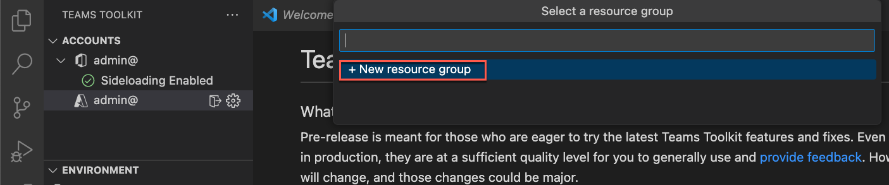

# Ejercicio 1: Creación de recursos de Azure para hospedar una aplicación de pestaña de Teams

En este ejercicio, primero creará y aprovisionará una aplicación de pestaña de Teams mediante el Kit de herramientas de Teams para Visual Studio Code. En un ejercicio posterior, configurará la aplicación para hospedarla en Azure.

**Nota**:  Los ejercicios de este módulo de entrenamiento usan el Kit de herramientas de Teams v5.0.0. En los pasos siguientes se supone que está instalada la extensión del Kit de herramientas de Teams.

## Tarea 1: Creación de una aplicación de pestaña

1. En la barra de actividades de Visual Studio Code, seleccione el icono de **Microsoft Teams**.

1. En el panel de Kit de herramientas de Teams, seleccione el botón **Crear aplicación**.

1. Entre las opciones, seleccione **Pestaña**.

    

1. A continuación, seleccione **React con Fluent UI**.

    

1. En las opciones de lenguaje de programación, seleccione **JavaScript**.

1. Seleccione una **ubicación** para la carpeta de proyecto de la aplicación de pestaña y todos sus archivos.

1. Como nombre de la aplicación, escriba **hello-tab** y seleccione Entrar.

1. Comienza el andamiaje del proyecto. Cuando se aplica el andamiaje al proyecto, se abre una nueva ventana de Visual Studio Code con el nuevo proyecto cargado.

    

1. En Visual Studio Code, seleccione **Ejecutar > Iniciar depuración** o seleccione la tecla **F5** para iniciar la sesión de depuración.

1. Visual Studio Code compila e inicia la aplicación. Ejecute la sesión de depuración antes de empezar a aprovisionar cualquier recurso de Azure.

1. Cuando la aplicación se pruebe correctamente, deje de ejecutarla localmente.

1. Para finalizar la sesión de depuración y dejar de ejecutar la aplicación, puede cerrar el explorador y seleccionar **Ejecutar > Detener depuración** o bien seleccionar **Mayús+F5**.

## Tarea 2: Inicio de sesión en Azure en el Kit de herramientas de Teams

Inicie sesión en Azure mediante la cuenta de la **suscripción de Azure**.

1. En la barra de actividades, seleccione el icono de **Microsoft Teams**.

1. En el panel de Kit de herramientas de Teams, en **Cuentas**, seleccione **Iniciar sesión en Azure**.

    

1. En el cuadro de diálogo que aparece, seleccione **Iniciar sesión**.

    

## Tarea 3: Aprovisionamiento de recursos

Ahora puede aprovisionar los recursos que necesita la aplicación de pestaña de Teams.

1. En el panel de Kit de herramientas de Teams, en **Ciclo de vida**, seleccione **Aprovisionar**.

    

1. A continuación, debe seleccionar un grupo de recursos donde pueda aprovisionar los recursos o crear un nuevo grupo mediante la opción **Nuevo grupo de recursos** del menú **Seleccionar un grupo de recursos**.

    

1. La herramienta sugiere automáticamente el nombre del grupo de recursos, como rg-hello-tab0989fd-dev. Seleccione **Entrar**.

1. A continuación, seleccione la **ubicación Este de EE. UU.** para el nuevo grupo de recursos y seleccione **Entrar**.

1. En el cuadro de diálogo que aparece para confirmar la selección, elija **Aprovisionar**.

    

1. Comienza el aprovisionamiento de todos los recursos que necesite para hospedar la aplicación de pestaña de Teams en Azure. El aprovisionamiento puede tardar unos minutos.

Ahora ha aprovisionado correctamente todos los recursos que necesita para hospedar la aplicación de pestaña de Teams.

A continuación, implementará el código fuente de la aplicación en estos recursos.
