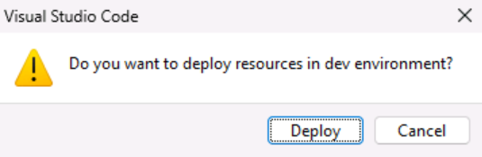
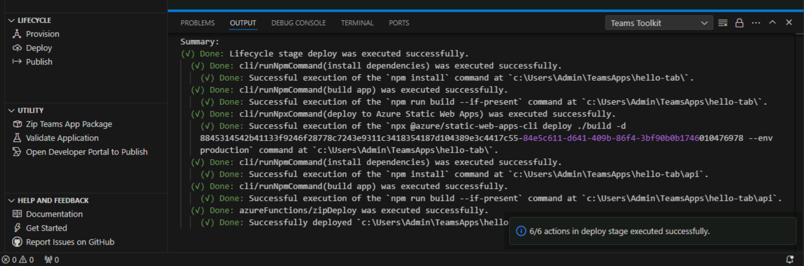

# Ejercicio 2: Implementación del código fuente de la aplicación

En este ejercicio, implementará el código fuente en los recursos de Azure aprovisionados.

## Tarea 1: Implementación mediante el kit de herramientas de Teams

1. En la barra de actividad de Visual Studio Code, seleccione el icono del **Kit de herramientas de Teams**.

2. En el panel Kit de herramientas de Teams, en **Ciclo de vida**, seleccione **Implementar**.

    

3. En el cuadro de diálogo de confirmación de la implementación, seleccione **Implementar**.

    .

4. Compruebe si la implementación se ha realizado correctamente en el editor de Visual Studio Code.

    

El código de la aplicación de pestañas de Teams se hospeda correctamente en Azure Storage y está listo para publicarse en Teams.

En el ejercicio siguiente, aprenderá a publicar la aplicación de Teams.
