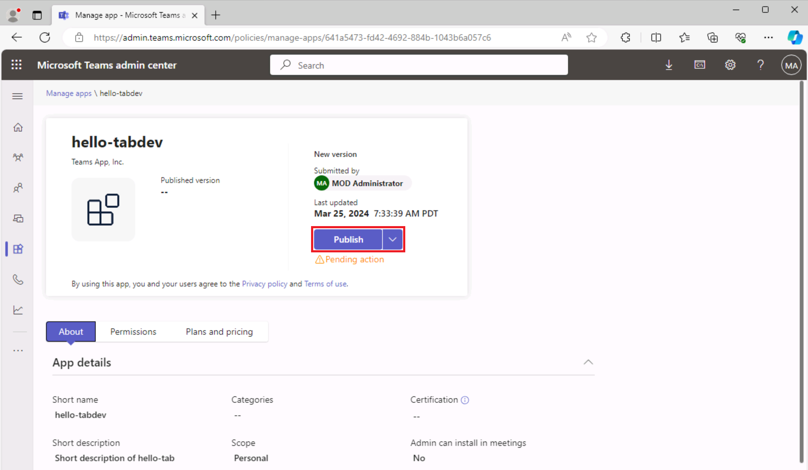
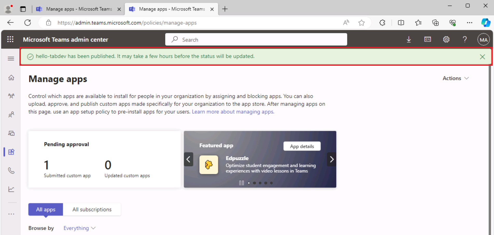
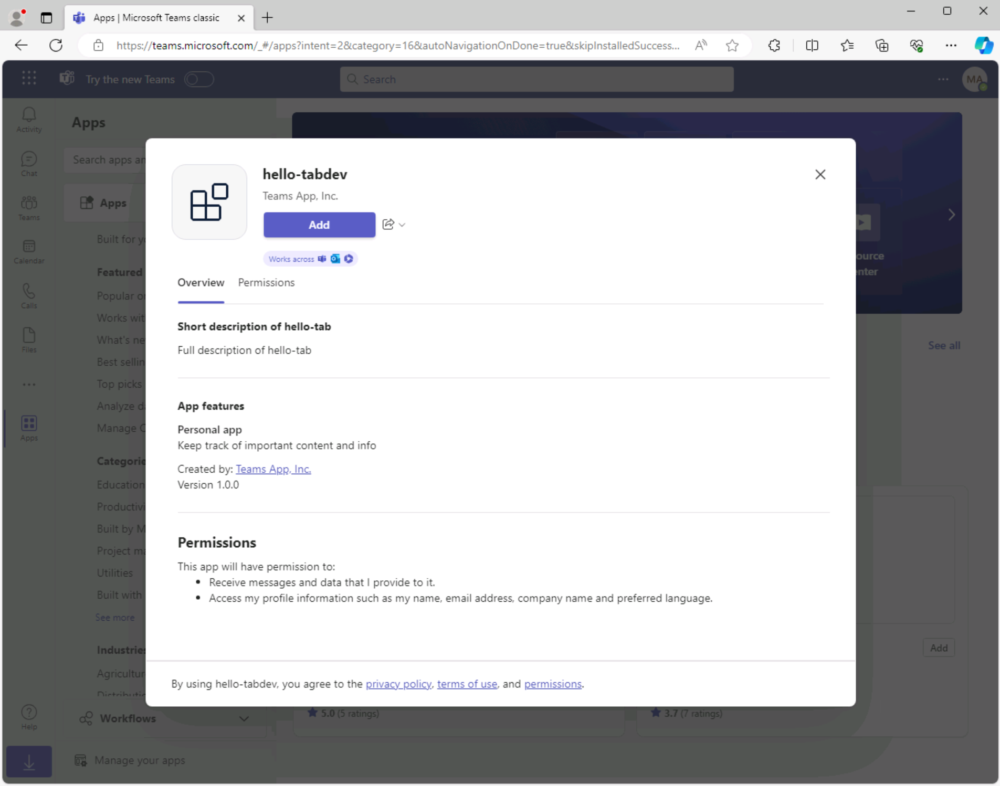

# Ejercicio 3: Publicación de la aplicación de pestañas de Teams

En este ejercicio, aprenderá a publicar la aplicación en la tienda de la organización.

## Tarea 1: Publicar la aplicación en una tienda

1. En Visual Studio Code, en la barra de actividades, seleccione el **icono de Microsoft Teams** para abrir el **panel Kit de herramientas de Teams**.

    

1. En el panel Kit de herramientas de Teams, en **Ciclo de vida**, seleccione **Publicar**.

1. Un cuadro de diálogo indica que la aplicación se ha publicado correctamente en el portal de administración de Microsoft Teams.

1. En el cuadro de diálogo, seleccione **Ir al portal de administración** para abrir el **Centro de administración de Microsoft Teams**.  Inicie sesión con la **cuenta de inquilino de Microsoft 365**.

    a. 

    b. 

1. En el menú **Administrar aplicaciones** del Centro de administración de Teams, busque el cuadro de texto **Buscar por nombre**. 
1. Escribe **hello-tabdev** para filtrar la lista de aplicaciones. A continuación, **seleccione la aplicación** para ver los detalles de la aplicación.

    

1. En el panel de detalles de la aplicación **hello-tabdev**, selecciona **Publicar**.

    

1. En el cuadro de diálogo **¿Publicar la aplicación personalizada?**, seleccione **Publicar**.

1. Un banner verde indica que se ha publicado la aplicación hello-tab.

    

Ahora que la aplicación se publica en la tienda de la organización, abra Microsoft Teams e instale la aplicación desde la tienda de la organización.

## Tarea 2: Instalación de la aplicación desde la tienda

1. Abra el cliente de Microsoft Teams o inicie sesión en Microsoft Teams en línea ([teams.microsoft.com](https://teams.microsoft.com/)) con sus **credenciales de inquilino de Microsoft 365**.
2. En Microsoft Teams, vaya a **Aplicaciones** para ver la tienda de la organización. En **Compilado para la organización**, selecciona el icono **hello-tabdev**.

    a. 

3. En el cuadro de diálogo de instalación de la aplicación, seleccione **Agregar**.

    a. 

4. Se abre la aplicación y aparece el mensaje **Su aplicación se está ejecutando en el entorno** de Azure.

    
