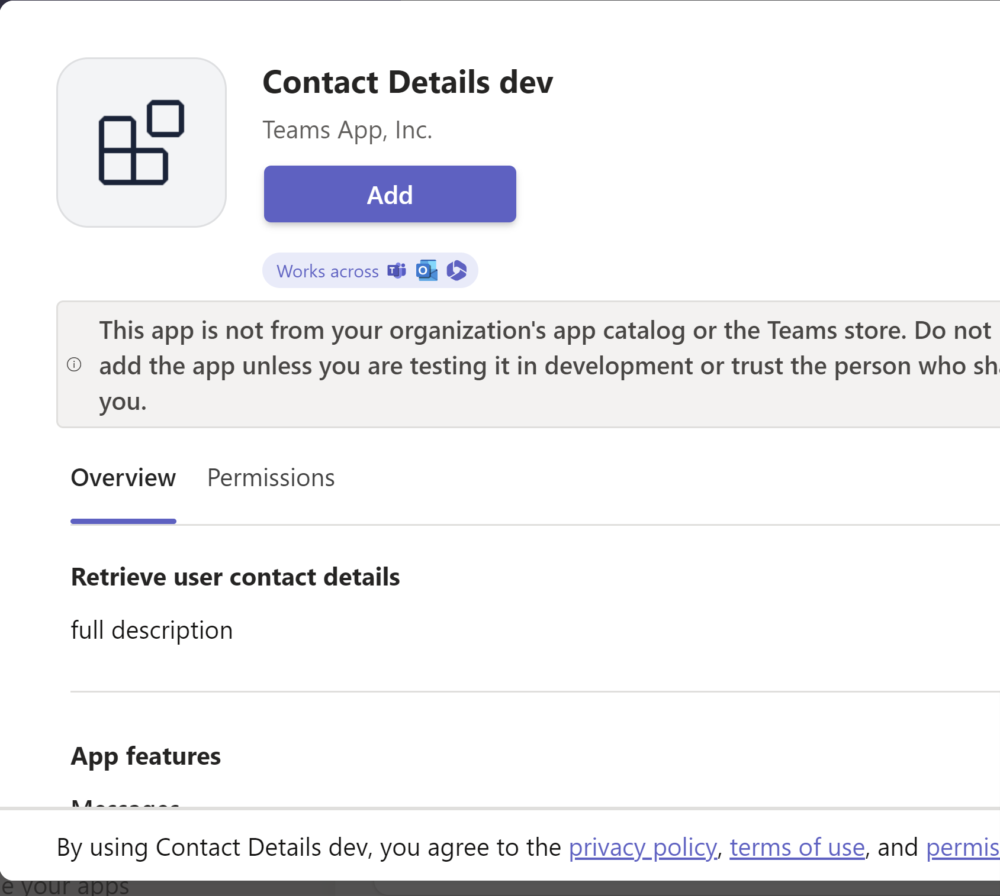

---
lab:
  title: "Implementación de una extensión de mensaje que recupera datos de Microsoft\_Graph"
  module: Exercise 1
---

# Ejercicio 1: Implementación de una extensión de mensaje que recupera datos de Microsoft Graph

## Escenario

Supongamos que le han pedido que ayude al equipo de soporte informático a desarrollar una extensión de mensajería que permita a los miembros del equipo recuperar información de contacto de los usuarios e insertarla en los mensajes de Teams usando tarjetas.  En este ejercicio, implementará una extensión de mensaje que recupera datos de usuario de Microsoft Graph.  Ya se ha aplicado scaffolding a la solución utilizando el kit de herramientas de Teams, pero tendrá que hacer cambios para implementar las funciones.

## Tareas de ejercicio

El objetivo es asegurarse de que la aplicación tiene la siguiente funcionalidad:


- Los usuarios de la aplicación escriben el nombre de un usuario en la interfaz de usuario de la extensión de mensajería.
- La aplicación usa el punto de conexión de Graph API `users` para buscar usuarios por nombre para mostrar y enumera los resultados.
- Cuando el usuario de la aplicación selecciona el usuario deseado en los resultados de la búsqueda, puede insertar la tarjeta deseada en un mensaje en Teams.
- La tarjeta muestra el nombre para mostrar del usuario, la dirección de correo electrónico y el número de teléfono


Debe realizar las siguientes tareas para completar el ejercicio:

1. Acceda al proyecto y revíselo.
2. Complete la funcionalidad de búsqueda.
3. Agregue las consultas de Graph.
4. Aprovisione recursos para la extensión de mensajería.
5. Configure los permisos para acceder a Microsoft Graph.
6. Implementación en Azure.
7. Ejecute y pruebe la aplicación.

**Tiempo estimado de finalización:** 25 minutos

## Tarea 1: Acceda al proyecto y revíselo

Se ha aplicado scaffolding a la aplicación de extensión de mensajería usando el kit de herramientas de Teams.  La aplicación también se ha actualizado para recuperar datos de usuario de Microsoft Graph mediante la biblioteca cliente de JavaScript de Microsoft Graph.  Parte del código está incompleto.

1. Descargue el proyecto [ContactDetails.zip](https://github.com/MicrosoftLearning/APL-4001-Build-collaborative-apps-for-Microsoft-Teams/raw/master/Allfiles/Labs/Starter/ContactDetails.zip) de la carpeta [Starter](https://github.com/MicrosoftLearning/APL-4001-Build-collaborative-apps-for-Microsoft-Teams/tree/master/Allfiles/Labs/Starter).
2. Extraiga el contenido del archivo ZIP en una carpeta denominada **ContactDetails** en el equipo y, a continuación, abra la carpeta en Visual Studio Code.  
3. Revise los directorios y archivos del proyecto en el área Explorador de Visual Studio Code para familiarizarse con el código fuente.  Entre las carpetas y archivos clave se incluyen:

| Carpeta / Archivo | Contenido |
| --- | --- |
| `teamsapp.yml` | El archivo de proyecto principal describe la configuración de la aplicación y define el conjunto de acciones que se ejecutarán en cada fase del ciclo de vida. |
| `teamsapp.local.yml` | Esto invalida `teamsapp.yml` con acciones que permiten la ejecución local y la depuración. |
| `.vscode/` | Archivos de VSCode para la depuración local. |
| `appPackage/` | Los archivos del paquete de la aplicación, incluido el manifiesto de aplicación de Teams. |
| `infra/` | Plantillas para el aprovisionamiento de recursos de Azure. |
| `index.js` | Punto de entrada de la aplicación y controlador de `restify`. |
| `teamsBot.js` | Controlador de actividad de Teams.  |

## Tarea 2: Complete la funcionalidad de búsqueda

Falta código para almacenar el valor de la cadena de consulta de búsqueda para su uso en la consulta de Graph.  Actualice el código para almacenar este valor en una variable denominada  `searchQuery`.

1. Vaya al archivo **TeamsBot.ts**.
2. En el método `handleTeamsMessagingExtensionQuery`, busque el comentario **// Obtener el contexto de búsqueda de los parámetros de consulta.** en la línea 81 y agregue la siguiente línea de código en la línea siguiente:

    ```JavaScript
    const searchQuery = query.parameters[0].value;
    ```

## Tarea 3: Actualice la consulta de Graph

Falta la ruta de acceso de API para la consulta de Graph que usa la cadena de búsqueda.  Actualice la consulta para usar `$search` para buscar usuarios por nombre para mostrar.

1. En la función `handleTeamsMessagingExtensionQuery`, busque el siguiente comentario en la línea 84:

      `// Use the Graph API to search for users by their display name.`

2. En la siguiente línea de código, reemplace `path` por la siguiente ruta de acceso de API:

     ```TypeScript
     /users?$search="displayName:${searchQuery}"&$count=true
     ```

Ahora el código debería cumplir los requisitos de funcionalidad.

## Tarea 4: Aprovisione recursos para la extensión de mensajería

A continuación, use el kit de herramientas de Teams para aprovisionar los recursos necesarios para la extensión de mensajería.

> Nota: El aprovisionamiento de recursos en la nube de Azure y la implementación en Azure pueden provocar cargos en la suscripción de Azure.

1. En Visual Studio Code, seleccione  **Kit de herramientas de Teams** en la barra lateral.
2. En **CUENTAS**, inicie sesión en el inquilino de Microsoft 365 y en su **cuenta de Azure**.
3. En **CICLO DE VIDA**, seleccione **Aprovisionar**.
    
4. Seleccione un grupo de recursos en el que pueda aprovisionar los recursos o cree un nuevo grupo de recursos seleccionando la opción **Nuevo grupo de recursos** y siguiendo las indicaciones.  
    
5. En el cuadro de diálogo final para confirmar la selección, seleccione **Aprovisionar**.

    Una vez completado el aprovisionamiento, se debe crear un nuevo registro de aplicaciones en el inquilino de Microsoft 365 mediante el entorno `dev` del Kit de herramientas de Teams. El aprovisionamiento puede tardar unos minutos.

    

## Tarea 5: Configure los permisos para recuperar datos de Microsoft Graph

1. Inicie sesión en Azure Portal en [portal.azure.com](portal.azure.com) usando su cuenta de administrador de **Microsoft 365**.
2. En el menú de navegación izquierdo, vaya a **Microsoft Entra ID**.
3. Vaya a **Administrar > Registros de aplicaciones > Todos los registros**.
4. Seleccione el registro de aplicación **ContactDetails** que se creó durante el aprovisionamiento.
5. Navegue hasta **Administrar > Permisos de API.**
6. Seleccione **+ Agregar un permiso.**
7. Seleccione **Microsoft Graph**.
8. Seleccione **Permisos delegados**.
9. Busque los permisos que aparecen en **Usuario** y seleccione el permiso **User.Read.All**.
    
10. Seleccione el botón **Agregar permisos**.
11. El permiso está configurado, pero requiere el consentimiento del administrador.
    
12. Seleccione **Conceder autorización de administrador para [inquilino]** y después seleccione **Sí** para confirmar.

El permiso se ha configurado y aprobado.

## Tarea 6: Implementación en Azure

Implemente la aplicación en los recursos aprovisionados en el entorno de `dev`.

1. En el panel Kit de herramientas de Teams, en **Ciclo de vida**, seleccione **Implementar**.
2. En el cuadro de diálogo de confirmación de la implementación, seleccione **Implementar**.
3. Compruebe si la implementación se ha realizado correctamente en el editor de Visual Studio Code.

La extensión de mensajería se hospeda en Azure.

## Comprobar el trabajo

Obtenga una vista previa de la aplicación en el cliente de Teams para probar la funcionalidad.

1. En el panel del kit de herramientas de Teams, en **Desarrollo**, seleccione **Vista previa de su aplicación de Teams (F5)**.
2. En el menú desplegable, seleccione la opción deseada para **Iniciar repositorio remoto** con su explorador preferido.

    

3. Cuando se ejecuta la aplicación por primera vez, se descargan todas las dependencias y se compila la aplicación. Cuando la compilación haya finalizado, se abrirá una ventana del navegador. Este proceso puede tardar entre tres y cinco minutos en completarse.
4. Teams muestra una ventana con los requisitos de descripción y permisos de la aplicación.  Seleccione **Agregar** para agregar la aplicación.

    

5. Cuando se cargue la extensión de mensajería en el cliente de Teams, escriba una letra para buscar usuarios por su nombre para mostrar.  Seleccione un resultado para insertar una tarjeta en la conversación.

Nota: Si por algún motivo la extensión de mensaje no se invoca automáticamente, puede acceder a ella escribiendo "@Contact Detalles dev" en la barra de comandos de la parte superior del cliente de Teams o en el área de redacción de mensajes.  También puede usar el botón **Acciones y aplicaciones** del área Redactar mensaje para encontrar la aplicación.
