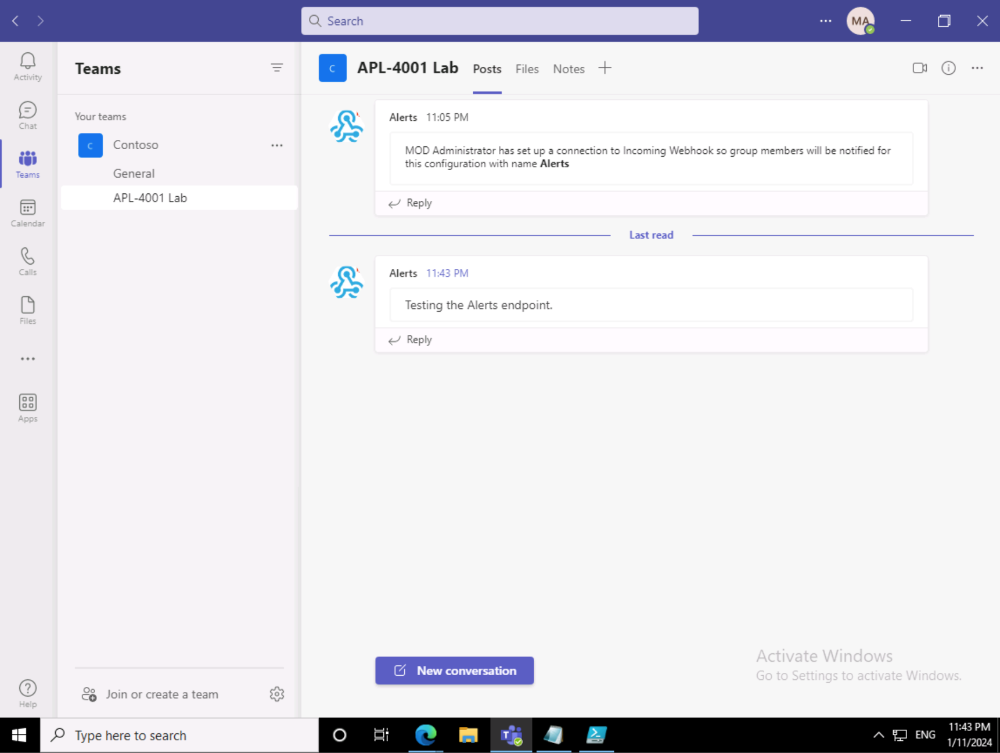

---
lab:
  title: Creación de un webhook entrante
  module: Exercise 2
---

# Ejercicio 2: Creación de un webhook entrante

## Escenario

Supongamos que el equipo de soporte técnico de TI usa un servicio de notificaciones de terceros para administrar las alertas y los mensajes. Recientemente, el equipo decidió automatizar el proceso de publicación de mensajes en un canal de Teams que se usa para las actualizaciones críticas.  El servicio de terceros está diseñado para publicar mensajes a través de un webhook.  

## Tareas del ejercicio

La tarea consiste en crear un nuevo webhook entrante, denominado **Alertas**, para recibir estos mensajes.  También debe probar el webhook para asegurarse de que puede aceptar y mostrar un mensaje con la cadena `"Testing the Alerts endpoint."` correctamente. El equipo actualizará el servicio con la dirección URL del punto de conexión del webhook cuando complete las tareas.

Para finalizar el ejercicio, debes completar las siguientes tareas:

1. Registra el webhook entrante.
2. Publicar un mensaje para probar el webhook.

**Tiempo estimado de finalización:** 8 minutos

## Tarea 1: Registro de un webhook entrante

En primer lugar, registre un webhook entrante.

**Nota:** Si la cuenta de Teams que usa para este ejercicio aún no tiene un equipo con un canal en ella, cree un nuevo canal antes de completar los pasos siguientes.

1. En Microsoft Teams, vaya a un canal donde puede configurar el webhook.
2. En el canal, seleccione el menú **Más opciones** y, a continuación, seleccione **Conectores**.  (Nota: use el menú dentro del canal, no el menú de la lista de canales).
3. Busque `"webhook"` y seleccione **webhook entrante**.

   

4. Seleccione **Agregar**.
5. En la página de información general, seleccione **Agregar**.
6. En el canal, seleccione de nuevo el menú **Más opciones** y, a continuación, seleccione **Conectores**.
7. Junto a **webhook entrante** seleccione **Configurar**.
8. En el nombre, escriba **Alertas**.
9. Seleccione **Crear**.  Deje abierta esta ventana para que pueda copiar la dirección URL durante la siguiente tarea.

Ha configurado un webhook entrante en el canal.

## Tarea 2: Publicación de un mensaje para probar el webhook

Para probar el webhook, use PowerShell para enviar un mensaje al punto de conexión del webhook.

1. Abra **PowerShell**.
2. Ejecute el siguiente comando para enviar el mensaje.  Reemplace <YOUR WEBHOOK URL> por la dirección URL de la ventana de configuración del webhook en Teams de la tarea anterior:

     ```powershell
     Invoke-RestMethod -Method post -ContentType 'Application/Json' -Body '{"text":"Testing the Alerts endpoint."}' -Uri <YOUR WEBHOOK URL>
    ```

## Comprobar el trabajo

1. En el cliente de Microsoft Teams, vaya a la pestaña **Conversaciones** del canal configurado.
2. Compruebe la presencia de un mensaje en el canal de `Alerts` que dice `"Testing the Alerts endpoint"`.

 
