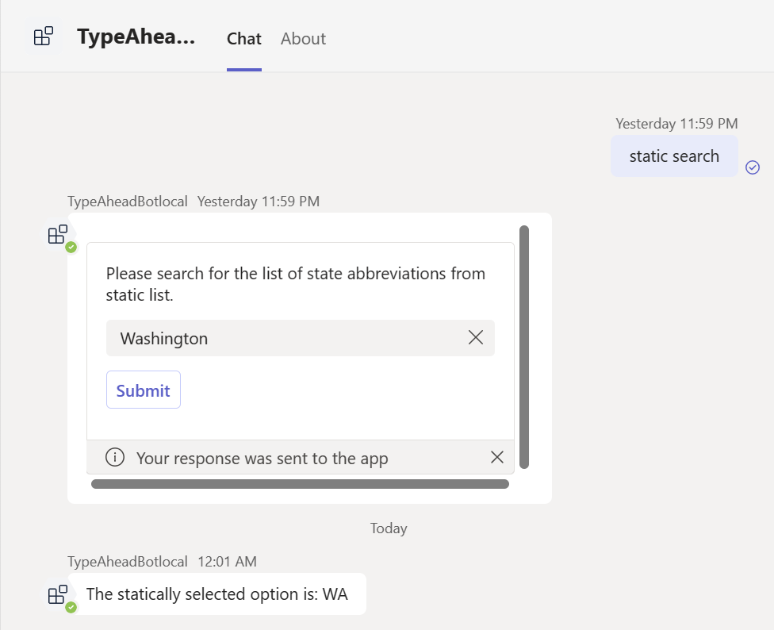
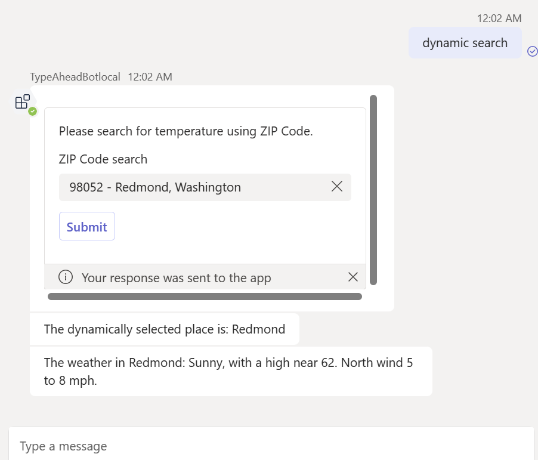

---
lab:
  title: Compilar un bot básico
  module: Exercise 6
---

# Ejercicio 6: Compilar un bot básico

## Escenario
Supongamos que se te ha pedido que ayudes al equipo de soporte técnico de TI a compilar un bot de Teams. Este bot tendrá la capacidad de recuperar la abreviatura de un estado determinado y también capturar las condiciones meteorológicas actuales de un área específica en función de su código postal.

## Tareas del ejercicio
En este ejercicio, usarás la plantilla Teams Toolkit para crear un bot de Teams básico. Este bot usará la biblioteca de IA de Teams para procesar mensajes con usuarios e incluirá interacciones mediante tarjetas adaptables. Ten en cuenta que este ejercicio no implica interacciones entre la biblioteca de IA de Teams y los LLM.

Debe realizar las siguientes tareas para finalizar el ejercicio:

1. Crea un bot de Teams con la plantilla de bot básica de Teams Toolkit.
1. Integra la biblioteca de IA de Teams.
1. Crea tarjetas adaptables.
1. Controla los mensajes.

**Tiempo estimado de finalización:** 15 minutos

## Tarea 1: Crear un bot de Teams con la plantilla de Teams Toolkit

**Objetivo**: inicializar un proyecto de bot básico de Teams con Teams Toolkit en Visual Studio Code.

Use la plantilla Bot de comandos para crear un bot:

1. Abra Visual Studio Code.
1. En la barra lateral, seleccione el icono de **Microsoft Teams** para abrir el panel **KIT DE HERRAMIENTAS DE TEAMS**.
1. Selecciona el botón **Crear una nueva aplicación**.
1. En el menú **Nuevo proyecto**, selecciona **Bot** y, después, **Bot básico** para compilar un bot básico.
1. En Lenguaje de programación, seleccione **TypeScript**.
1. Para **carpeta del área de trabajo** seleccione o cree una carpeta para almacenar los archivos de su proyecto en su equipo.
1. En **Nombre de la aplicación**, escribe **TypeAheadBot** y presiona **Entrar**. El Kit de herramientas de Teams aplicará scaffolding a una nueva aplicación y abrirá la carpeta del proyecto en Visual Studio Code.
1. Puede recibir un mensaje de Visual Studio Code que le pregunte si confía en los autores de los archivos de esta carpeta. Seleccione el botón **Sí, confío en los autores** para continuar.
1. Revise los directorios y archivos del proyecto mediante el Explorador de Visual Studio Code para familiarizarse con el código fuente.

## Tarea 2: Integrar la biblioteca de IA de Teams

**Objetivo**: agregar la biblioteca de IA de Teams al proyecto para mejorar las funcionalidades del bot.

1. En Visual Code, presiona ``Ctrl + ` `` para abrir el terminal.
1. En el terminal, ejecuta el comando siguiente para instalar la biblioteca de IA de Teams y los paquetes de Axios necesarios. El paquete de Axios es un cliente HTTP basado en promesas que usaremos en este ejercicio para llamar a las API web.
   ```shell
   npm install @microsoft/teams-ai axios --save
   ```
1. Crea un archivo `app.ts` en el directorio raíz del proyecto. Agrega el código siguiente al archivo para definir y exportar el objeto `app`.
   ``` typescript
   // See https://aka.ms/teams-ai-library to learn more about the Teams AI library.
   import { Application } from "@microsoft/teams-ai";
   
   const app = new Application();
   
   export default app;
   ```
1. Abra el archivo `index.ts` en la raíz del proyecto. Reemplaza la referencia a `TeamsBot` con el objeto `app`. Se puede hacer referencia al archivo final de `index.ts` en [index.ts](../../../Allfiles/Labs/Guided-Exercise6/index.ts).
   1. Reemplaza *Este diálogo principal del bot.* sección por el código siguiente:
      
      Insertar fragmento de código
      ``` typescript
      import app from "./app";
      ``` 
      Quitar fragmento de código
      ``` typescript
      // This bot's main dialog.
      import { TeamsBot } from "./teamsBot";
      ```
   1. Quita el fragmento de código *Crear el bot que controlará los mensajes entrantes.*
      ``` typescript
      // Create the bot that will handle incoming messages.
      const bot = new TeamsBot();
      ```
   1. Modifica el fragmento de código *Escuchar las solicitudes entrantes.* Para usar el objeto `app` para responder a los mensajes.
      ``` typescript
      // Listen for incoming requests.
      server.post("/api/messages", async (req, res) => {
        await adapter.process(req, res, async (context) => {
          await app.run(context); //replace bot with app object
        });
      });
      ```

## Tarea 3: Crear tarjetas adaptables

**Objetivo**: diseñar e implementar tarjetas adaptables para interacciones de datos dinámicos y estáticos dentro del bot.

1. Crea una carpeta denominada `cards` en el directorio raíz de este proyecto.
1. En la carpeta `cards`, crea un archivo denominado `staticSearchCard.ts` con el contenido siguiente. Se puede hacer referencia al archivo final de `staticSearchCard.ts` en [staticSearchCard.ts](../../../Allfiles/Labs/Guided-Exercise6/staticSearchCard.ts).
   ```typescript
   import { Attachment, CardFactory } from 'botbuilder';

    export function createStaticSearchCard(): Attachment {
        return CardFactory.adaptiveCard({
            $schema: 'http://adaptivecards.io/schemas/adaptive-card.json',
            version: '1.2',
            type: 'AdaptiveCard',
            body: [
                {
                    text: 'Please search for the list of state abbreviations from static list.',
                    wrap: true,
                    type: 'TextBlock'
                },
                {
                    columns: [
                        {
                            width: 'stretch',
                            items: [
                                {
                                    choices:
                                        [
                                            { title: 'Alabama', value: 'AL' },
                                            { title: 'Alaska', value: 'AK' },
                                            { title: 'Arizona', value: 'AZ' },
                                            { title: 'Arkansas', value: 'AR' },
                                            { title: 'California', value: 'CA' },
                                            { title: 'Colorado', value: 'CO' },
                                            { title: 'Connecticut', value: 'CT' },
                                            { title: 'Delaware', value: 'DE' },
                                            { title: 'Florida', value: 'FL' },
                                            { title: 'Georgia', value: 'GA' },
                                            { title: 'Hawaii', value: 'HI' },
                                            { title: 'Idaho', value: 'ID' },
                                            { title: 'Illinois', value: 'IL' },
                                            { title: 'Indiana', value: 'IN' },
                                            { title: 'Iowa', value: 'IA' },
                                            { title: 'Kansas', value: 'KS' },
                                            { title: 'Kentucky', value: 'KY' },
                                            { title: 'Louisiana', value: 'LA' },
                                            { title: 'Maine', value: 'ME' },
                                            { title: 'Maryland', value: 'MD' },
                                            { title: 'Massachusetts', value: 'MA' },
                                            { title: 'Michigan', value: 'MI' },
                                            { title: 'Minnesota', value: 'MN' },
                                            { title: 'Mississippi', value: 'MS' },
                                            { title: 'Missouri', value: 'MO' },
                                            { title: 'Montana', value: 'MT' },
                                            { title: 'Nebraska', value: 'NE' },
                                            { title: 'Nevada', value: 'NV' },
                                            { title: 'New Hampshire', value: 'NH' },
                                            { title: 'New Jersey', value: 'NJ' },
                                            { title: 'New Mexico', value: 'NM' },
                                            { title: 'New York', value: 'NY' },
                                            { title: 'North Carolina', value: 'NC' },
                                            { title: 'North Dakota', value: 'ND' },
                                            { title: 'Ohio', value: 'OH' },
                                            { title: 'Oklahoma', value: 'OK' },
                                            { title: 'Oregon', value: 'OR' },
                                            { title: 'Pennsylvania', value: 'PA' },
                                            { title: 'Rhode Island', value: 'RI' },
                                            { title: 'South Carolina', value: 'SC' },
                                            { title: 'South Dakota', value: 'SD' },
                                            { title: 'Tennessee', value: 'TN' },
                                            { title: 'Texas', value: 'TX' },
                                            { title: 'Utah', value: 'UT' },
                                            { title: 'Vermont', value: 'VT' },
                                            { title: 'Virginia', value: 'VA' },
                                            { title: 'Washington', value: 'WA' },
                                            { title: 'West Virginia', value: 'WV' },
                                            { title: 'Wisconsin', value: 'WI' },
                                            { title: 'Wyoming', value: 'WY' }
                                        ],
                                    style: 'filtered',
                                    placeholder: 'Search for a state abbreviation',
                                    id: 'choiceSelect',
                                    type: 'Input.ChoiceSet'
                                }
                            ],
                            type: 'Column'
                        }
                    ],
                    type: 'ColumnSet'
                }
            ],
            actions: [
                {
                    id: 'staticSubmit',
                    type: 'Action.Submit',
                    title: 'Submit',
                    data: {
                        verb: 'StaticSubmit'
                    }
                }
            ]
        });
    }
   ```

1. En la carpeta `cards`, crea un archivo denominado `dynamicSearchCard.ts` con el contenido siguiente. Se puede hacer referencia al archivo final de `dynamicSearchCard.ts` en [dynamicSearchCard.ts](../../../Allfiles/Labs/Guided-Exercise6/dynamicSearchCard.ts).
   ```typescript
   import { Attachment, CardFactory } from 'botbuilder';

   export function createDynamicSearchCard(): Attachment {
        return CardFactory.adaptiveCard({
            $schema: 'http://adaptivecards.io/schemas/adaptive-card.json',
            version: '1.6',
            type: 'AdaptiveCard',
            body: [
                {
                    text: 'Please search for temperature using ZIP Code.',
                    wrap: true,
                    type: 'TextBlock'
                },
                {
                    columns: [
                        {
                            width: 'stretch',
                            items: [
                                {
                                    choices: [],
                                    'choices.data': {
                                        type: 'Data.Query',
                                        dataset: 'locations',
                                        value: 'value'
                                    },
                                    id: 'choiceSelect',
                                    type: 'Input.ChoiceSet',
                                    placeholder: 'ZIP Code',
                                    label: 'ZIP Code search',
                                    isRequired: false,
                                    errorMessage: 'There was an error test.',
                                    isMultiSelect: false,
                                    style: 'filtered'                                
                                }
                            ],
                            type: 'Column'
                        }
                    ],
                    type: 'ColumnSet'
                }
            ],
            actions: [
                {
                    id: 'submitdynamic',
                    type: 'Action.Submit',
                    title: 'Submit',
                    data: {
                        verb: 'DynamicSubmit'
                    }
                }
            ]
        });
    }

   ```

## Tarea 4: Controlar mensajes

**Objetivo**: desarrollar la capacidad del bot para responder a las entradas del usuario e interactuar a través de tarjetas adaptables.

En este paso, agregaremos la funcionalidad de respuesta de mensajes al objeto `app`.

1. Abra el archivo `app.ts` .
1. Debajo del código que crea el objeto de aplicación `const app = new Application();`, agrega el código siguiente para controlar mensajes diferentes.
    ``` typescript
    interface SubmitData {
        choiceSelect?: string;
    }

    app.message(/static/i, async (context, _state) => {
        const attachment = createStaticSearchCard();
        await context.sendActivity({ attachments: [attachment] });
    });

    app.message(/dynamic/i, async (context, _state) => {
        const attachment = createDynamicSearchCard();
        await context.sendActivity({ attachments: [attachment] });
    });

    // Listen for query from dynamic search card
    app.adaptiveCards.search('locations', async (context: TurnContext, state: TurnState, query) => {
        // Format search results
        const locations: AdaptiveCardSearchResult[] = [];
        // Execute query
        const searchQuery = query.parameters['queryText'] ?? '';
        if (searchQuery.length < 4) {
            return locations;
        }   

        const response = await axios.get(
            `https://zip-api.eu/api/v1/codes/postal_code=US-${searchQuery}*`
        );

        interface DataObject {
            state: string;
            place_name: string;
            postal_code: string;
            lat:string
            lng:string
        };

        //response data is an array of objects or an object
        response.data = Array.isArray(response.data) ? response.data : [response.data];
        response.data.forEach((obj: DataObject) => {
            const result: AdaptiveCardSearchResult = {
                title: `${obj.postal_code} - ${obj.place_name}, ${obj.state}`,
                value: `${obj.postal_code}|${obj.place_name}|${obj.lat}|${obj.lng}`
            };
            locations.push(result);
        });

        // Return search results
        return locations;
    });

    // Listen for submit buttons
    app.adaptiveCards.actionSubmit('DynamicSubmit', async (context, _state, data: SubmitData) => {
        let [postalCode, placeName, lat, lon] = data.choiceSelect?.split('|') ?? [];
        await context.sendActivity(`The dynamically selected place is: ${placeName}`);
        const weatherLocation = await axios.get(
            `https://api.weather.gov/points/${lat},${lon}`
        );
        const forcast = await axios.get(weatherLocation.data.properties.forecast);
        await context.sendActivity(`The weather in ${placeName}: ${forcast.data.properties.periods[0].detailedForecast}`);
        });

        app.adaptiveCards.actionSubmit('StaticSubmit', async (context, _state, data: SubmitData) => {
        await context.sendActivity(`The statically selected option is: ${data.choiceSelect}`);
        });

        // Listen for ANY message to be received. MUST BE AFTER ANY OTHER HANDLERS
        app.activity(ActivityTypes.Message, async (context, _state) => {
        await context.sendActivity(`Try saying "static search" or "dynamic search".`);
    });
    ```

1. En la parte superior del archivo `app.ts`, actualiza las referencias relacionadas como se indica a continuación. Se puede hacer referencia al archivo final de `app.ts` en [app.ts](../../../Allfiles/Labs/Guided-Exercise6/app.ts).
    
    Actualizado
    ```` typescript
    import { ActivityTypes, TurnContext } from "botbuilder";
    import { createStaticSearchCard } from "./cards/staticSearchCard";
    import { createDynamicSearchCard } from "./cards/dynamicSearchCard";
    import axios from "axios";
    // See https://aka.ms/teams-ai-library to learn more about the Teams AI library.
    import { Application, TurnState, AdaptiveCardSearchResult } from "@microsoft/teams-ai";
    ````
    Anterior
    ```` typescript
    // See https://aka.ms/teams-ai-library to learn more about the Teams AI library.
    import { Application } from "@microsoft/teams-ai";
    ````    

## Comprobar el trabajo

Ejecute la aplicación localmente para probar la funcionalidad:

1. Abra el panel del **KIT DE HERRAMIENTAS DE TEAMS**. En el menú **DESARROLLO**, seleccione **Vista previa de su aplicación de Teams** (o use la clave `F5`) y, a continuación, seleccione **Depurar en Teams ()** con su explorador preferido.  
1. El kit de herramientas de Teams aprovisionará y ejecutará la aplicación localmente en un explorador.
1. En el cuadro de diálogo de instalación de la aplicación en el explorador, seleccione **Agregar** para instalar la aplicación de Teams.  Teams abre una conversación con el bot instalado.
1. En el cuadro de diálogo del mensaje, escribe `static search` y presiona Entrar. El bot devolverá una tarjeta adaptable.
1. En el cuadro de entrada, selecciona o escribe un nombre de estado y selecciona el botón **Enviar**. El bot devolverá la abreviatura de ese nombre de estado. 
1. En el cuadro de diálogo del mensaje, escribe `dynamic search` y presiona Entrar.
1. En el cuadro de diálogo de entrada, escribe un código postal de EE. UU. y selecciona el botón **Enviar**. El bot devolverá el tiempo actual para esa área. 